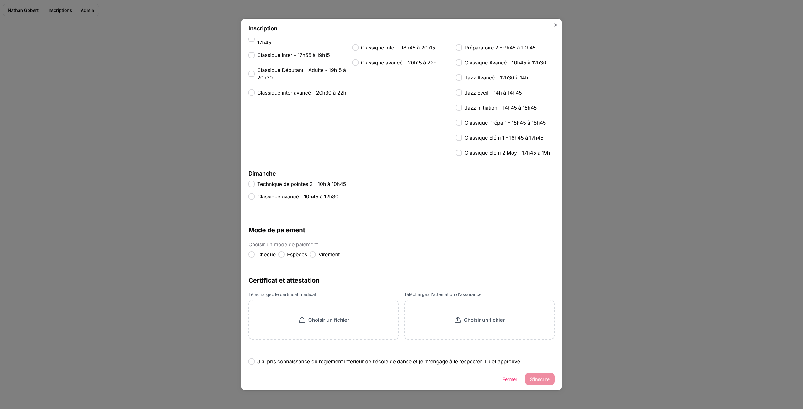
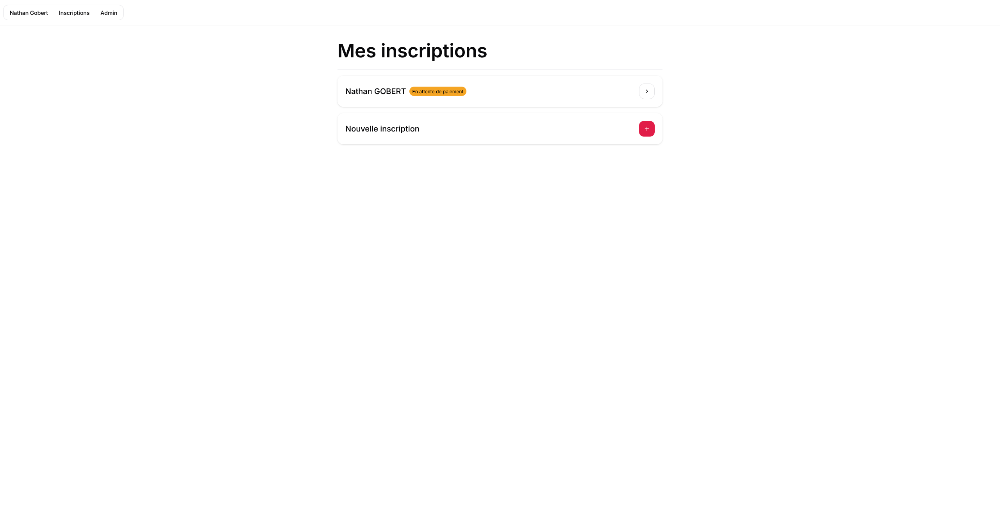
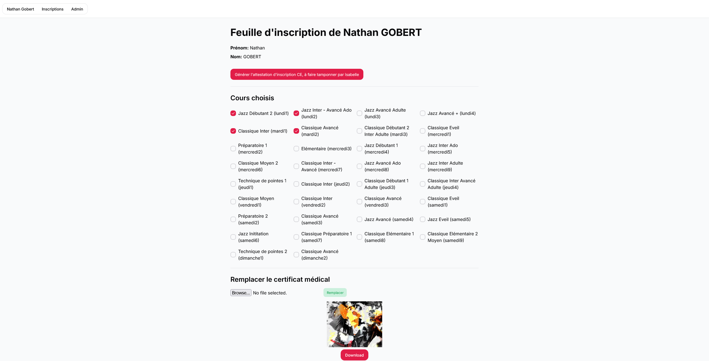
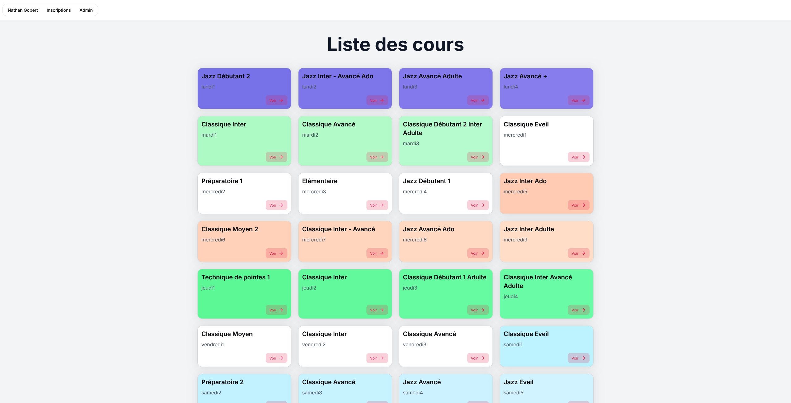
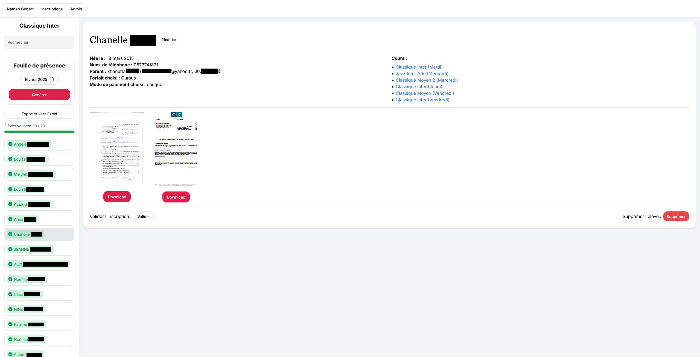
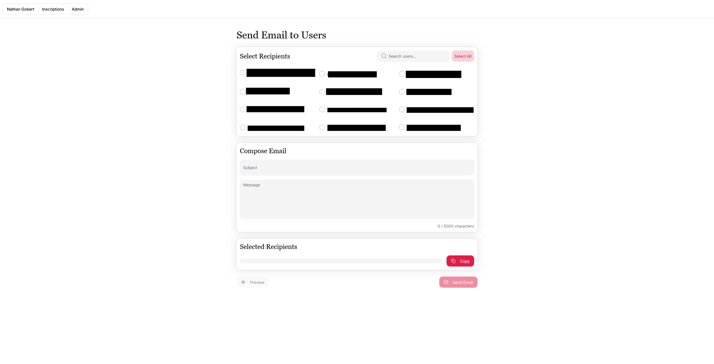
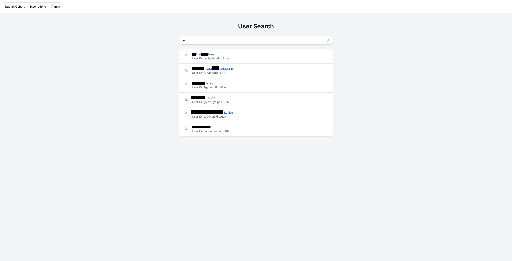

## Features

### For Parents
- **Account Creation**: Parents can easily create accounts to manage their daughters' enrollment.
- **Student Registration**: Register your daughters for various ballet courses offered by the school.
- **Course Selection**: Choose from a variety of courses tailored to different skill levels and interests.
- **Payment Methods**: Select and manage payment methods conveniently within the platform.

### For Teachers
- **Admin Panel**: Teachers have access to an admin panel where they can oversee all their courses.
- **Student Information**: Click on a course to view a list of all enrolled students.
- **Detailed Student Profiles**: Click on a student's name to access more detailed information about them.
- **Export to CSV**: Export course information to a CSV file for easy record-keeping and analysis.
- **Attendance Sheet Generation**: Generate printable attendance sheets, a feature preferred by our clients for easy tracking.

## Technology Stack
- **Frontend**: Built using Next.js, a powerful React framework that enables fast and efficient web applications.
- **Backend**: Powered by PocketBase, a lightweight and versatile database solution that simplifies data management.

